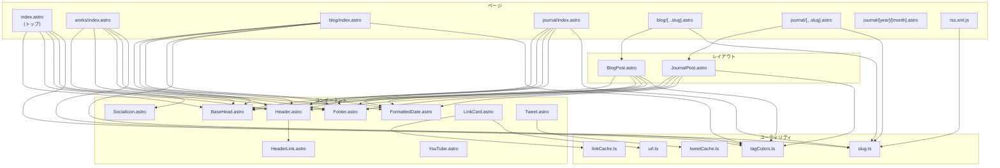

# fryx404.github.io — AI エージェント引き継ぎ資料 v01

> 作成日: 2026-04-13
> 対象リポジトリ: `fryx404/fryx404.github.io`
> ローカルパス: `c:\Users\FRYX\Documents\WebSite\my-site`

---

## 1. プロジェクト概要

古屋 匠（Takumi Furuya / @fryx404）の個人ポートフォリオサイト。
CG Designer / Rigger / Creator としての作品・ブログ・日記を公開する静的サイト。

| 項目 | 値 |
|---|---|
| フレームワーク | **Astro v5.18.0**（SSG） |
| パッケージマネージャ | **npm**（ローカル開発・CI共にnpmに統一。bunは廃止） |
| ホスティング | **GitHub Pages**（`main` ブランチ push で自動デプロイ） |
| 公開 URL | `https://fryx404.github.io` |
| 言語 | TypeScript（strict mode） |

---

## 2. 技術スタック

### 依存関係

| パッケージ | バージョン | 用途 |
|---|---|---|
| `astro` | ^5.17.1 | フレームワーク本体 |
| `@astrojs/mdx` | ^4.3.13 | MDX サポート（Markdown 内でコンポーネント使用） |
| `@astrojs/rss` | ^4.0.15 | RSS フィード生成 |
| `@astrojs/sitemap` | ^3.7.1 | サイトマップ自動生成 |
| `sharp` | ^0.34.3 | 画像最適化（`astro:assets` の `Image` コンポーネント用） |
| `sanitize-html` | ^2.17.2 | Tweet 埋め込みの HTML サニタイズ |

### 開発依存

| パッケージ | バージョン | 用途 |
|---|---|---|
| `@astrojs/check` | ^0.9.8 | TypeScript 型チェック |
| `@types/sanitize-html` | ^2.16.1 | 型定義 |
| `prettier-plugin-astro` | ^0.14.1 | Astro ファイルのフォーマッタ |
| `typescript` | ^6.0.2 | TypeScript |

### 設定特記事項

- `astro.config.mjs`: `site` を `https://fryx404.github.io` に設定
- Vite エイリアス `@components` → `/src/components`（`tsconfig.json` にも `paths` 設定あり）
- `tsconfig.json`: bun.lock 廃止に伴い `bun-types` も削除済

---

## 3. ディレクトリ構成

```
my-site/
├── .agents/                # AI エージェント用資料（.gitignore対象）
│   ├── handoff/            # 引き継ぎ資料
│   ├── plan/               # 実装計画
│   └── sessions/           # セッション記録
├── .github/workflows/
│   └── deploy.yml          # GitHub Pages デプロイ CI
├── public/
│   ├── fonts/              # Atkinson フォント（woff）
│   ├── icons/              # Profile.png（ファビコン＆アバター）
│   └── googleaa3b2b0b4fa4a6ad.html  # Google Search Console 認証
├── scripts/
│   └── benchmark-link-card.ts  # LinkCard のパフォーマンスベンチマーク
├── src/
│   ├── components/         # 共有 Astro コンポーネント
│   ├── content/            # コンテンツコレクション（Markdown/MDX）
│   │   ├── blog/           # BLOG 記事
│   │   ├── journal/        # JOURNAL 日記
│   │   └── works/          # WORKS 作品
│   ├── layouts/            # ページレイアウト
│   ├── pages/              # ルーティング（ファイルベース）
│   ├── styles/             # グローバル CSS
│   ├── utils/              # ユーティリティ関数
│   ├── consts.ts           # サイト定数
│   └── content.config.ts   # コンテンツコレクション定義
├── astro.config.mjs
├── tsconfig.json
└── package.json
```

---

## 4. コンテンツコレクション

3 つのコレクションが `src/content.config.ts` で定義されている。すべて Zod スキーマでバリデーション。

### 4.1 共通フロントマター

| フィールド | 型 | 必須 | 説明 |
|---|---|:---:|---|
| `title` | `string` | ✅ | タイトル |
| `pubDate` | `date` | ✅ | 公開日 (`YYYY-MM-DD`) |
| `updatedDate` | `date` | — | 更新日 |
| `tags` | `string[]` | — | タグ配列 |
| `description` | `string` | — | 説明文（OGP にも使用） |
| `image` | `image()` | — | サムネイル画像（相対パス） |

### 4.2 Works 固有フィールド

| フィールド | 型 | 必須 | 説明 |
|---|---|:---:|---|
| `url` | `string` | — | 外部リンク（GitHub, BOOTH 等） |

### 4.3 ファイル配置パターン

```
src/content/
├── works/YYYY/MM/作品名/
│   ├── index.md（または index.mdx）
│   └── images/             # 記事内画像
├── blog/YYYY/MM/DD/
│   ├── index.mdx
│   └── *.png               # 記事内画像
└── journal/YYYY/MM/
    └── YYYY-MM-DD.md       # 日記（1日1ファイル）
```

### 4.4 MDX コンポーネントの使用

Blog と Works の MDX ファイルでは以下のインポートが定型パターン:

```mdx
import LinkCard from '@components/LinkCard.astro';
import YouTube from '@components/YouTube.astro';
import Tweet from '@components/Tweet.astro';
```

---

## 5. ルーティングとページ構成

### 5.1 ルート一覧

| パス | ファイル | 説明 |
|---|---|---|
| `/` | `pages/index.astro` | トップページ（プロフィール） |
| `/works` | `pages/works/index.astro` | 作品一覧（プロダクトショーケース形式・ジグザグ配置） |
| `/blog` | `pages/blog/index.astro` | ブログ一覧 |
| `/blog/YYYY/MM/DD/` | `pages/blog/[...slug].astro` | ブログ詳細 |
| `/journal` | `pages/journal/index.astro` | 日記一覧（月別アーカイブ付き） |
| `/journal/YYYY/MM/DD/` | `pages/journal/[...slug].astro` | 日記詳細 |
| `/journal/YYYY/MM/` | `pages/journal/[year]/[month].astro` | 月別アーカイブ |
| `/rss.xml` | `pages/rss.xml.js` | RSS フィード（blog のみ） |

### 5.2 スラッグ生成

`src/utils/slug.ts` の `idToSlug()` 関数で、コンテンツ ID から `/index.md(x)` や `.md(x)` 拡張子を除去してスラッグを生成。

```ts
// 例: "2026/03/PDFbridge/index.mdx" → "2026/03/PDFbridge"
export function idToSlug(id: string): string {
  return id.replace(/\/index\.(md|mdx)$/, "").replace(/\.(md|mdx)$/, "");
}
```

### 5.3 ページネーション

- **Blog**: 初期 15 件表示 → 「もっと見る」ボタンで 15 件ずつ追加表示
- **Works**: 初期 15 件表示 → 「もっと見る」ボタンで追加。表示はIntersection Observerでスクロールフェードイン。
- **Journal**: モバイル 6 件 / デスクトップ 12 件 → 「もっと見る」で追加
- 実装: `.post-hidden` / `.mobile-hidden` クラスのトグルによるクライアントサイド制御

---

## 6. コンポーネント詳細

### 6.1 ページ骨格

| コンポーネント | 説明 |
|---|---|
| `BaseHead.astro` | `<head>` メタ情報（SEO / OGP / Twitter Card / canonical / RSS / sitemap） |
| `Header.astro` | スティッキーヘッダー + ハンバーガーメニュー（768px以下） |
| `HeaderLink.astro` | ナビリンク（現在のパスで `.active` クラス自動付与） |
| `Footer.astro` | シンプルなコピーライト |
| `HomeHero.astro` | トップページのヒーロー領域 |
| `HomeFeatures.astro` | トップページの「できること」一覧 |
| `HomeLikes.astro` | トップページの「すきなもの」ステッカー領域 |
| `SocialLinks.astro` | トップページ等のSNSリンク一覧 |
| `WorksShowcase.astro`| Worksページ内の作品表示カードコンポーネント |

### 6.2 レイアウト

| レイアウト | テーマカラー | 対象 |
|---|---|---|
| `BlogPost.astro` | `#22b8cf`（シアン） | Blog 詳細 |
| `JournalPost.astro` | `#20c997`（ミント） | Journal 詳細 |

全レイアウト共通仕様:
- ヒーロー画像（オプション）
- タイトル（`section-title-tag` スタイル）
- 日付表示（`FormattedDate` で `ja-JP` ロケール）
- タグ表示（ランダムカラー付与）
- 前後ナビゲーション（← → リンク）
- 一覧に戻るリンク

### 6.3 リッチコンテンツコンポーネント

| コンポーネント | 用途 | 主な特徴 |
|---|---|---|
| `LinkCard.astro` | 外部 URL のリッチプレビューカード | OGP メタデータの自動取得、favicon 表示、**Promise キャッシュ**で重複 fetch を排除、`isSafeUrl()` で SSRF 防御 |
| `Tweet.astro` | X（Twitter）ポスト埋め込み | oEmbed API 使用、`sanitize-html` でサニタイズ、**Promise キャッシュ**、失敗時はリンクにフォールバック |
| `YouTube.astro` | YouTube 動画埋め込み | `youtube-nocookie.com` 使用、`loading="lazy"`、複数 URL 形式対応 |
| `SocialIcon.astro` | SNS アイコン SVG | 8種対応: x, github, note, bluesky, linkedin, behance, artstation, mail |
| `FormattedDate.astro` | 日本語日付フォーマット | `ja-JP` ロケール、`<time>` タグ + `datetime` 属性 |

---

## 7. デザインシステム

### 7.1 デザインコンセプト: 「ステッカー/タグ風ポップ UI」

サイト全体で一貫した「ステッカーを貼ったノートブック」のようなビジュアルデザイン。

主な表現手法:
- **section-title-tag**: 見出しをステッカー風に表示（斜め配置 + クリックで水平に）
- **feature-tag**: タグを切り抜きラベル風（`clip-path: polygon()` + ランダム角度）
- **like-sticker**: 趣味アイテムをフローティングステッカー
- **カード**: 薄い色付き背景 + ホバーで浮き上がるアニメーション
- **ボタン**: pill 型 + 斜め配置 + ホバーで水平化

### 7.2 カラーパレット

#### CSS カスタムプロパティ（`global.css :root`）

| 変数 | 値 | 用途 |
|---|---|---|
| `--accent` | `#0051FF` | メインアクセント（ヘッダー active、リンク色） |
| `--accent-dark` | `#FF0066` | サブアクセント（ソーシャルアイコンホバー等） |
| `--black` | `#111827` | 見出し文字色 |
| `--gray` | `#9CA3AF` | ボーダー、薄い背景 |
| `--gray-light` | `#F3F4F6` | サイト背景、タグ背景 |
| `--gray-dark` | `#374151` | 本文テキスト |

#### テーマカラー（セクション別）

| セクション/ページ | カラー | 用途 |
|---|---|---|
| できること | `#ffca28`（イエロー） | section-title-tag |
| すきなもの | `#42dfb2`（ミント） | section-title-tag |
| SNS | `#4c6ef5`（ブルー） | section-title-tag |
| WORKS | `#845ef7`（パープル） | ページタイトル、CTAボタンのホバー |
| BLOG | `#22b8cf`（シアン） | ページタイトル・レイアウト |
| JOURNAL | `#20c997`（ミント） | ページタイトル・レイアウト |

#### タグカラー（`tagColors.ts`）

ランダムに割り当てられる 6 色。カード背景色と近い色は除外するロジックあり。

| name | bg（15%混合） | text |
|---|---|---|
| red | `#ff4b4b` | `#c92a2a` |
| blue | `#22b8cf` | `#0b7285` |
| purple | `#845ef7` | `#5f3dc4` |
| orange | `#ff922b` | `#d9480f` |
| green | `#94d82d` | `#5c940d` |
| pink | `#f06595` | `#a61e4d` |

#### カードテーマカラー（一覧ページ循環）

各一覧ページで `cardColors` 配列を定義し、`index % cardColors.length` で循環。
カードの背景 = `color-mix(in srgb, ${themeColor} 6%, #ffffff)`

### 7.3 タイポグラフィ

| 項目 | 値 |
|---|---|
| メインフォント | **Atkinson**（`/fonts/atkinson-*.woff`）+ `sans-serif` フォールバック |
| 基本フォントサイズ | 20px（モバイル: 18px） |
| 行間 | 1.7 |
| 見出しスケール | h1: 3.052em → h5: 1.25em（Modular Scale） |

### 7.4 レスポンシブ

| ブレークポイント | 変更内容 |
|---|---|
| `768px` | ハンバーガーメニュー表示、Journal のモバイル表示件数制限 |
| `720px` | フォントサイズ縮小、main パディング調整 |
| `480px` | LinkCard が縦積みレイアウト |

---

## 8. ユーティリティ関数

| ファイル | 関数/export | 説明 |
|---|---|---|
| `slug.ts` | `idToSlug(id)` | コンテンツ ID → URL スラッグ |
| `tagColors.ts` | `TAG_COLORS` | タグカラー定義配列 |
| `tagColors.ts` | `applyRandomTagColors(selector, colors?, root?)` | DOM 要素にランダムカラー + ランダム角度を付与 |
| `url.ts` | `isSafeUrl(url)` | SSRF 防御: http/https のみ許可、localhost/IP 直接指定をブロック |
| `linkCache.ts` | `linkMetadataCache` | `Map<string, Promise<LinkMetadata>>` — OGP 取得のキャッシュ |
| `tweetCache.ts` | `tweetHtmlCache` | `Map<string, Promise<string|null>>` — Tweet oEmbed のキャッシュ |

---

## 9. CI/CD パイプライン

### GitHub Actions（`.github/workflows/deploy.yml`）

```
main ブランチへ push → Node 20 + npm ci → astro build → GitHub Pages デプロイ
```

- `concurrency: pages / cancel-in-progress: false`
- 手動実行（`workflow_dispatch`）対応

> **注意**: 以前は `bun.lock` と `package-lock.json` の二重管理が存在していたが、現在は `npm` 一本に統一し `bun.lock` は削除されている。

---

## 10. コマンド一覧

| コマンド | 動作 |
|---|---|
| `npm run dev` | 開発サーバー起動（`localhost:4321`） |
| `npm run build` | `./dist/` に本番ビルド |
| `npm run preview` | ビルド結果のローカルプレビュー |

---

## 11. 既知の注意点・制約

### 11.1 （解消済）ロックファイルの二重管理
- かつて `bun.lock` と `package-lock.json` が共存しコンフリクトの原因となっていたが、現在は `npm` に統一され解消している。

### 11.2 GIF 画像の特別扱い
- Works コレクションで `image.format === "gif"` の場合、`astro:assets` の `Image` コンポーネントではなく素の `` タグを使用している（Astro の Image は GIF アニメーションを保持しないため）。

### 11.3 OGP 取得の制約
- `LinkCard.astro` はビルド時に外部 URL を fetch して OGP メタデータを取得する。
- ネットワーク障害やタイムアウト（5秒）の場合、URL テキストだけのフォールバック表示になる。
- レスポンスボディ 10MB 上限のガードあり。

### 11.4 ダークモード未対応
- 現在ライトモードのみ。CSS 変数の構成上、ダークモード対応は `:root` のカスタムプロパティ切り替えで実現可能な設計になっている。

### 11.5 .agents ディレクトリ
- `.gitignore` で除外されている。AI エージェントの作業記録用。
- `sessions/` 配下にセッション記録を保存するワークフローがユーザーのルールで定義されている。

---

## 12. 新しいコンテンツの追加手順

### 12.1 Works を追加する場合

> **注意**: Works 詳細ページは**廃止**されたため、`index.md` の本文（マークダウン本文）を書いてもサイト上には表示されません（フロントマターのみ使われます）。
> また、`pubDate` はサイト上には表示されませんが、リストの並び順（新しい順）を制御するために現在も**必須**です。

```
src/content/works/YYYY/MM/作品名/
├── index.md  (または index.mdx)
└── images/
    └── thumbnail.webp
```

フロントマター例:
```yaml
---
title: "Teiten — 1日1枚の写真日記"
pubDate: 2026-04-13  # 内部ソート用（画面には非表示）
description: "Android用のアプリを作成しました！"
tags: ["アプリ開発", "React Native", "Expo"]
image: "./images/Screen.webp"
url: "https://fryx404.github.io/teiten/"  # 新タブで直リンクされる
---
```

### 12.2 Blog を追加する場合

```
src/content/blog/YYYY/MM/DD/
├── index.mdx
└── *.png  (記事内画像)
```

フロントマター例:
```yaml
---
title: 記事タイトル
pubDate: 2026-04-13
tags:
  - Astro
  - Web
description: 記事の説明
image: ./images.png  # サムネイル（任意）
---
```

MDX コンポーネントの定型インポート:
```mdx
import LinkCard from '@components/LinkCard.astro';
import YouTube from '@components/YouTube.astro';
import Tweet from '@components/Tweet.astro';
```

### 12.3 Journal を追加する場合

```
src/content/journal/YYYY/MM/YYYY-MM-DD.md
```

フロントマター例:
```yaml
---
title: 2026年4月13日
pubDate: 2026-04-13
description: 日記
---
```

Journal は素の Markdown が多く、MDX コンポーネントは基本使わない。

---

## 13. コンポーネント間の依存関係



---

## 14. SNS・外部リンク

| サービス | URL |
|---|---|
| note | https://note.com/fryx404 |
| X | https://x.com/fryx404 |
| LinkedIn | https://www.linkedin.com/in/fryx404/ |
| GitHub | https://github.com/fryx404 |
| Behance | https://www.behance.net/fryx404/ |
| ArtStation | https://www.artstation.com/fryx404 |
| Contact | https://fryx404.notion.site/13259fe4f8ee80f0826ed878a6fa6a42 |
| Google Search Console | 認証済み（`public/googleaa3b2b0b4fa4a6ad.html`） |

---

## 15. よくある変更パターンとその影響範囲

### 15.1 新しいコンテンツコレクション追加

1. `src/content.config.ts` にスキーマ定義追加
2. `src/content/新コレクション名/` にファイル配置
3. `src/layouts/新レイアウト.astro` 作成（既存レイアウトをコピーしてテーマカラーを変更するのが最速）
4. `src/pages/新セクション/index.astro` と `[...slug].astro` を作成
5. `Header.astro` にナビリンク追加
6. RSS に含める場合は `rss.xml.js` を修正

### 15.2 デザイン変更

- カラー変更: `global.css` の `:root` CSS 変数を変更
- タグカラー変更: `tagColors.ts` の `TAG_COLORS` 配列を変更
- フォント変更: `global.css` の `@font-face` と `public/fonts/` のフォントファイルを変更
- レイアウト変更: `post.css` が全レイアウト共通スタイル

### 15.3 ヘッダーナビの変更

- `src/components/Header.astro` の `<HeaderLink>` 要素を追加/削除することでリンクを制御します。
- **モバイル版表示（768px以下）のレイアウト仕様**:
  - `nav` 要素に CSS Grid （`grid-template-columns: 1fr auto 1fr;`）を用いており、リンク群（`HOME`, `WORKS`, `BLOG`）は中央の列に、ハンバーガーメニューは右側の列に配置され、常に美しく中央揃えされる設計となっています。
  - スマホのトップバーに常時表示されるリンクを増やしたい場合は、`.internal-links > a:not([href="/"], [href="/works"], [href="/blog"])` のセレクター部分に表示させたいリンクを追加して非表示対象から外してください。

### 15.4 SNS リンクの追加

1. `SocialIcon.astro` の `paths` オブジェクトに SVG パスを追加
2. `Props` の `name` ユニオン型に追加
3. `index.astro` のソーシャルリンクセクションに `<a>` + `<SocialIcon>` を追加
4. ホバーカラーの CSS を追加（nth-child のインデックスに注意）

---

## 16. 開発Tips

### ローカル開発の起動

```bash
npm run dev    # → http://localhost:4321
```

### ビルド検証

```bash
npm run build && npm run preview
```

### 新しい MDX コンテンツ内で使えるコンポーネント

```mdx
<LinkCard url="https://example.com" />
<LinkCard url="https://example.com" title="手動タイトル" description="手動説明" image="https://example.com/og.png" />
<YouTube url="https://www.youtube.com/watch?v=VIDEO_ID" />
<Tweet url="https://twitter.com/user/status/TWEET_ID" />
```

### タグカラーの除外ロジック

一覧ページでカード背景色とタグ色が近くなりすぎないよう、`excludeMap` で色名を除外する仕組みがある。新しいカード色を追加する場合は、このマップも更新すること。
