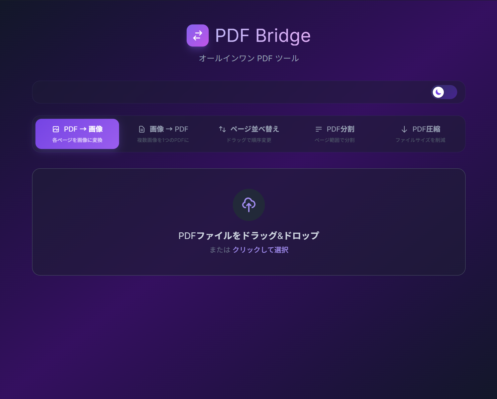
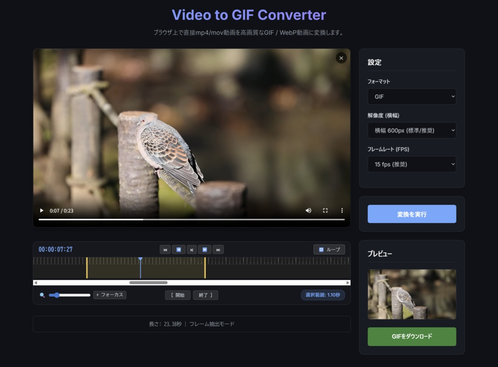
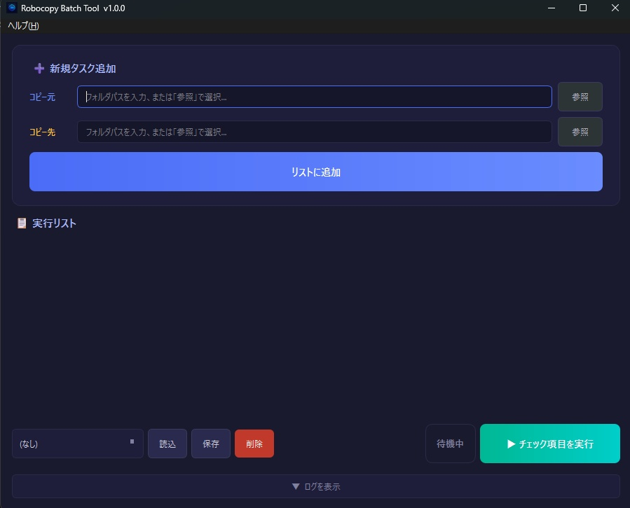

import LinkCard from '@components/LinkCard.astro';
import YouTube from '@components/YouTube.astro';
import Tweet from '@components/Tweet.astro';

最近PythonやTypeScript、JavaScriptといった言語でツールを作るのにハマっています。 
AIによるサポートもあり、デザイナーでもツールやアプリを作りやすい環境が整ってきていると感じています。 

今回は個人的に必要になったということもありますが、いくつかツールを作成したので紹介します。 

**PDF Bridge** 
PDFを圧縮したり分割したりするツールは色々とあると思います。 
でも検索して見つかるのは有料だったり、得体のしれないサーバーにアップしないといけなかったり、UIが使いづらかったりとなにかと制限があるものです。自分で作ることで、必要な機能を必要なときに使えるようになりました。 
画像↔️PDFの変換、ドラッグアンドドロップでのページ並び替え、複数のファイルに分割、サイズ圧縮ができます。 

<LinkCard url="https://fryx404.booth.pm/items/8087182" /> 

**Video to GIF Convertor** 
動画をGIFに変換するツールです。 
サクッと必要な箇所だけをGIFにしたいなと思ったときにPhotoshopやPremiereを開くのってめんどくさくないですか？そんなときに使いたくて作ってみました。 
GIF、WebP形式に変換できます。解像度やフレームレートも変更できます。GUIでわかりやすいです！ 

<LinkCard url="https://fryx404.booth.pm/items/8087182" /> 

**Robocopy Batch Tool** 
Robocopyコマンドを、GUIから簡単にバッチ実行できるツールです。黒い画面を見なくて済みます。 
他のHDDやドライブに同じデータを保存したいときにポチポチできます！ 
プリセット機能とかがあるので、個人的に使いやすいものになってます。 

<LinkCard url="https://fryx404.booth.pm/items/8139930" /> 

せっかく作ったのなら配布してみよう！ 
どうせ配布するなら有料にしてみよう！ 
という軽い気持ちでBOOTHで公開してみました。 

個人的にも初めての有料コンテンツであり緊張しています。
でも、もしこのツールが誰かの役に立つなら嬉しいなと思っています。 
今後も必要に応じて機能を追加していく予定です。 
もし何か要望があれば、DMなどで気軽にお知らせください。 
よろしくお願いします！