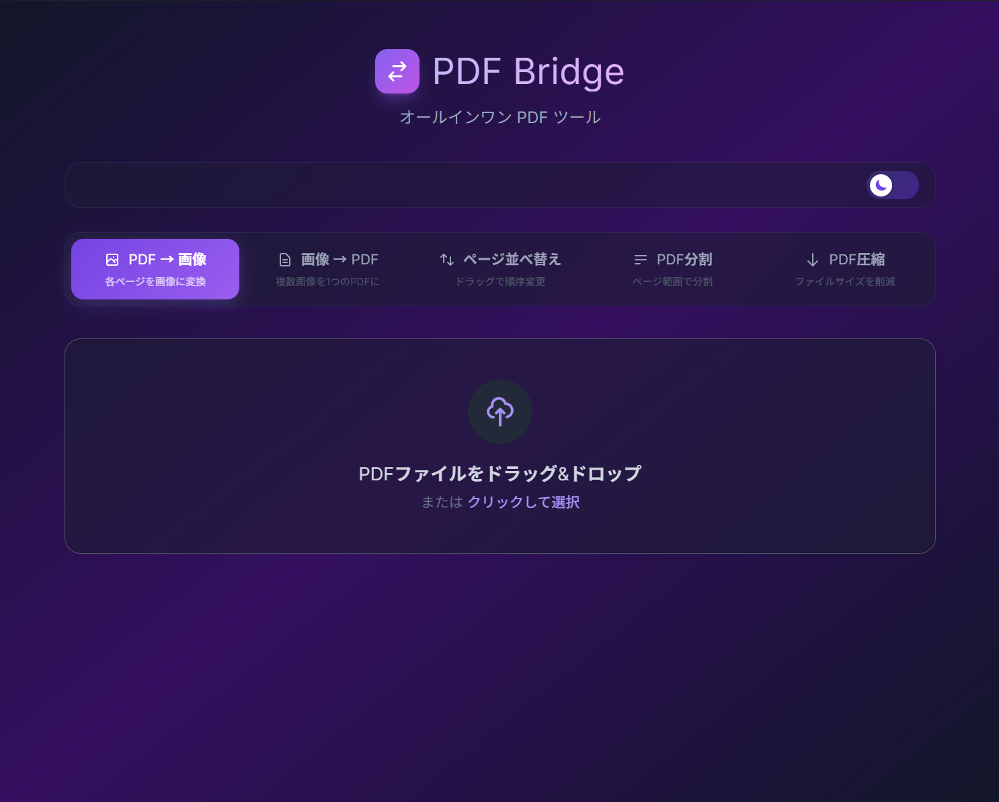
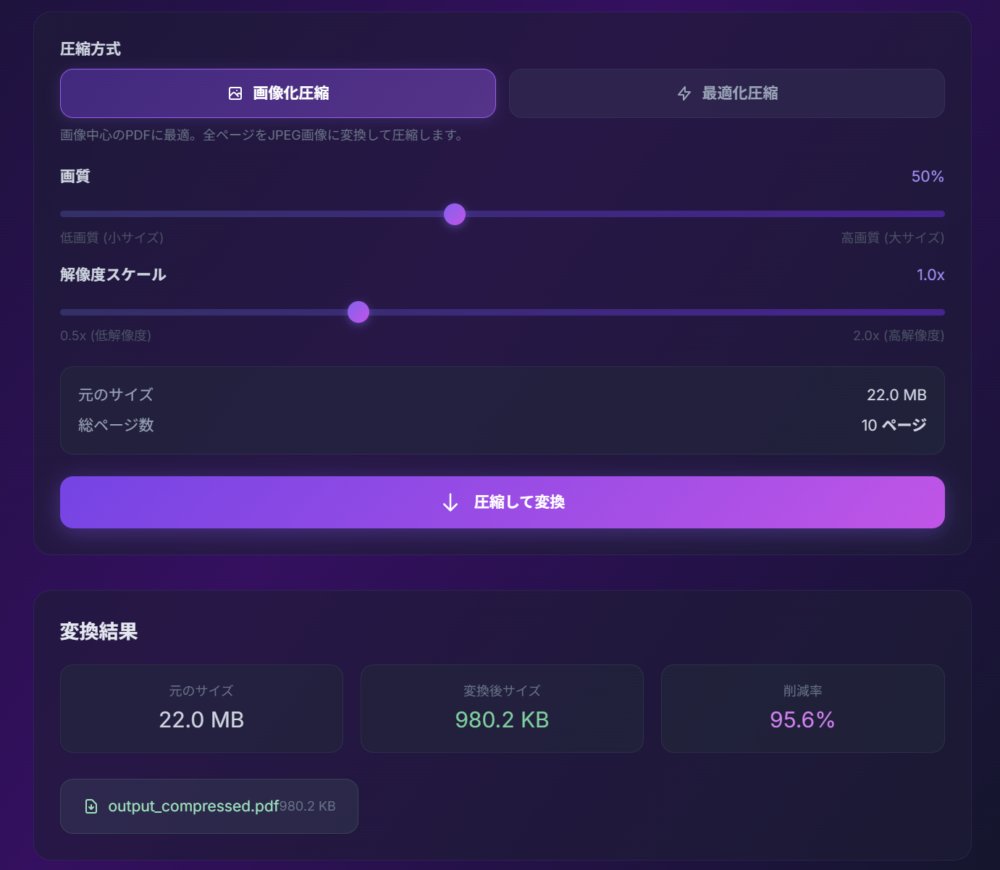
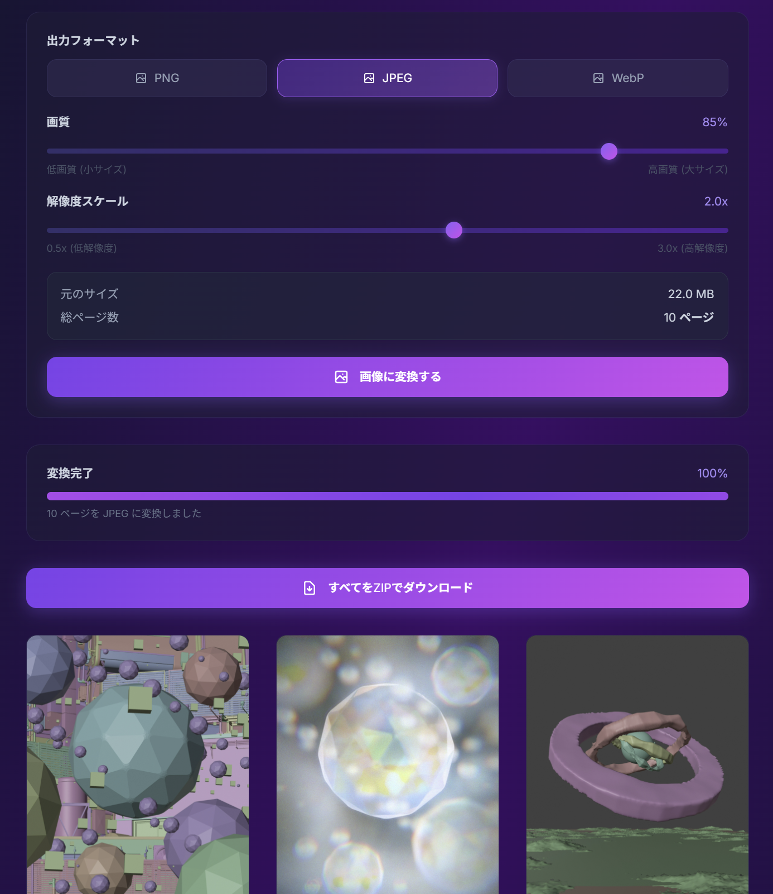

import LinkCard from '@components/LinkCard.astro';
import YouTube from '@components/YouTube.astro';
import Tweet from '@components/Tweet.astro';

最近PythonやTypeScript、JavaScriptといった言語でツールを作るのにハマっています。 
AIによるサポートもあり、デザイナーでもツールやアプリを作りやすい環境が整ってきていると感じています。 

今回は個人的に必要になったということもありますが、PDFを圧縮したり分割したりするツールを作ってみました。
そしてBOOTHで公開してみました。

<LinkCard url="https://fryx404.booth.pm/items/8087182" />  

PDFを圧縮したり分割したりするツールは色々とあると思います。 
でも検索して見つかるのは有料だったり、得体のしれないサーバーにアップしないといけなかったり、UIが使いづらかったりとなにかと制限があるものです。
自分で作ることで、必要な機能を必要なときに使えるようになりました。

個人的に絶対に欲しかった機能がPDFの圧縮機能でした。 
NotebookLMは1ファイルあたり200mbまでのPDFをアップロードできます。 
これ以上大きいサイズのファイルはそもそもソースとして読み込めないんですよね。

PDFの分割機能も欲しかった機能の一つです。 
圧縮することにより認識でいないくらい画質が劣化することもあるので、
分割して物理的にファイルサイズを小さくすることで、画質を保ったままNotebookLMに読み込ませることができます。

あとはPDFのページを直感的に並び替えたり、指定したページだけを抜き出したりする機能も作りました。 
画像からPDFを作成したり、PDFを連番画像にしたりといったいつか使うかもしれない機能も盛り込んでみました。

ローカル環境である程度形になったときに、配布用のパッケージの作成に着手したんですが、
ElectronやTauriといったデスクトップアプリのフレームワークがあることを知りました。

最終的にはTauriを使う形で落ち着きました。 
TauriはElectronと比べて、アプリのサイズが小さく、動作も軽快で、セキュリティ面でも優れていると感じました。 
実際、Electronも試してみたのですが、Chromiumを丸ごとバンドルする必要があるため、アプリのサイズが100mb近くと大きくなってしまいました。 
結果的にはTauriを使うことで、アプリのサイズを3mb程度に抑えることができました。もうこれはほぼないようなものです。 

せっかく作ったのなら配布してみよう！ 
どうせ配布するなら有料にしてみよう！ 
という軽い気持ちでBOOTHで公開してみました。 

個人的にも初めての有料コンテンツであり緊張しています。
でも、もしこのツールが誰かの役に立つなら嬉しいなと思っています。 
今後も必要に応じて機能を追加していく予定です。 
もし何か要望があれば、DMなどで気軽にお知らせください。 
よろしくお願いします！